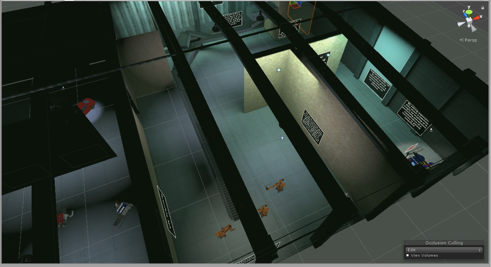

# VR_Showcase

This project uses Google Carboard SDK 1.2. 
I'm using the Occulus MovieSample.cs script to run videos in textures, it currently does not function on iOS. 

Most of my scripts are in the main Assets folder. Scripts for assets should be in their respective folders, and have liscense info at top, though I have added to or fixed bugs in almost all of them.

The first three areas have small puzzles. The origional idea was that you had to complete these puzzles to move into next area. Though the puzzles were very simple, I have removed the barriers so the user can freely move about, but the puzzles are still in the project.

The project is in the unimaginatively named main.unity scene. 

Check out the project page <a href="https://mi7flat5.github.io/VR_Showcase/">Here</a>

