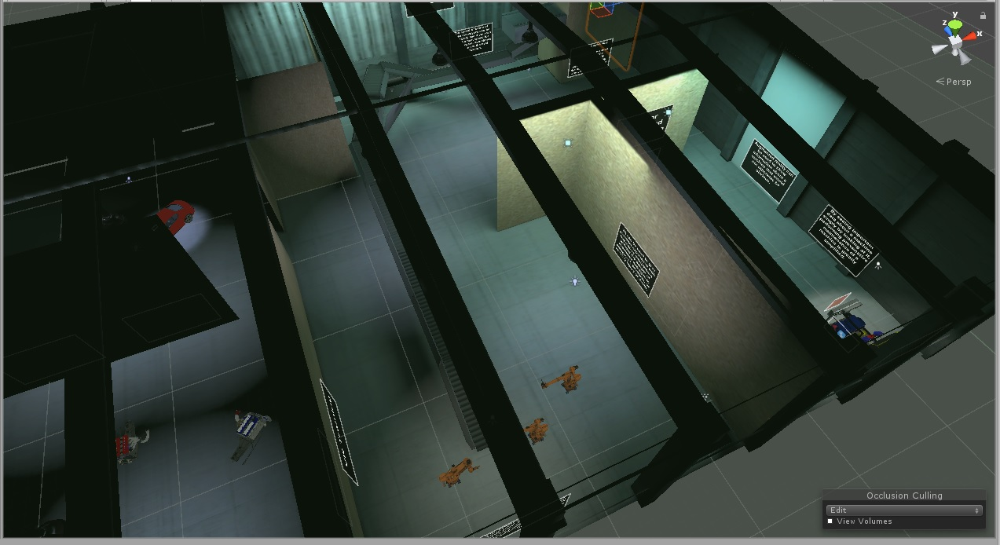

 

 <h1><b>VR Showcase</b></h1>
 <h2>This Project is a VR space made for Android\Google Cardboard, that exhibits VR's use in the manufacturing industry.
 </h2>

The setting is in a factory with 5 exibits, each of which have simple puzzles or intesting ways of interacting with the environment.
 

 

<iframe width="600" height="400"
src="Tour.mp4">
</iframe>

<h1><strong>Development</strong></h1>

<h1><strong>Other Projects</strong></h1>

Check out my other projects at <a href ="https://github.com/mi7flat5">www.github.com/mi7flat5</a>, and keep an eye on <a href ="https://mi7flat5.github.io">mi7flat5.github.io</a> for other project pages like this one.

